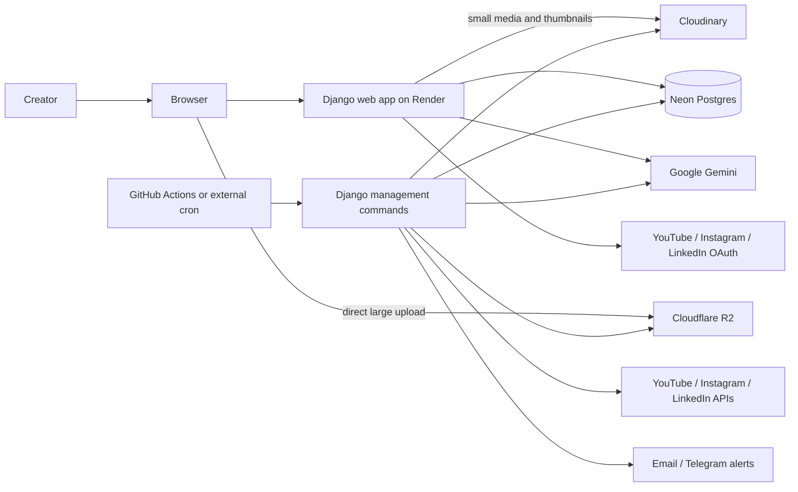
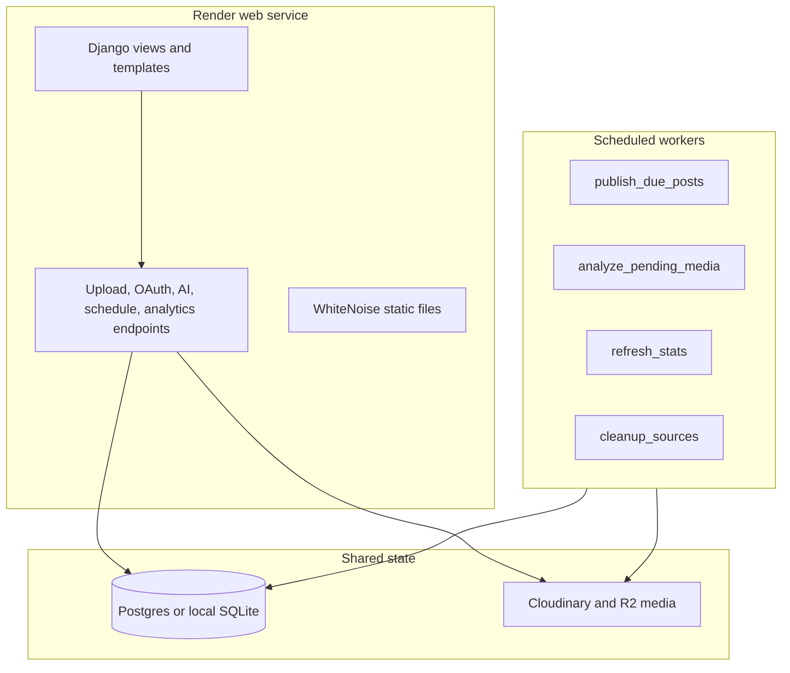
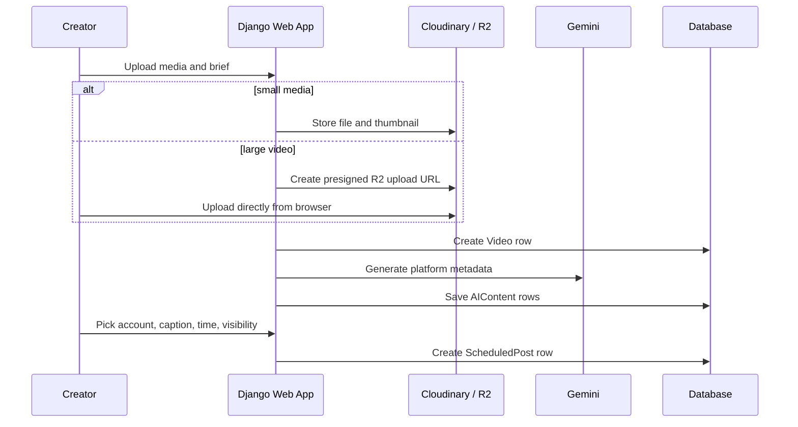
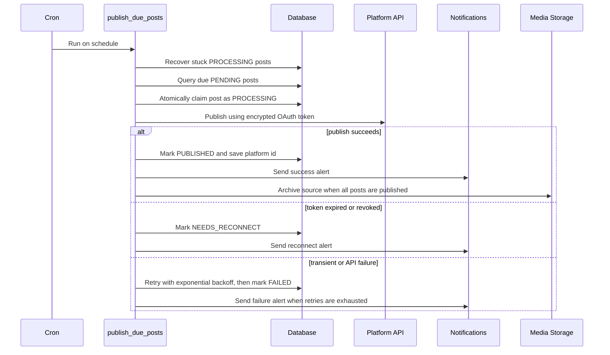
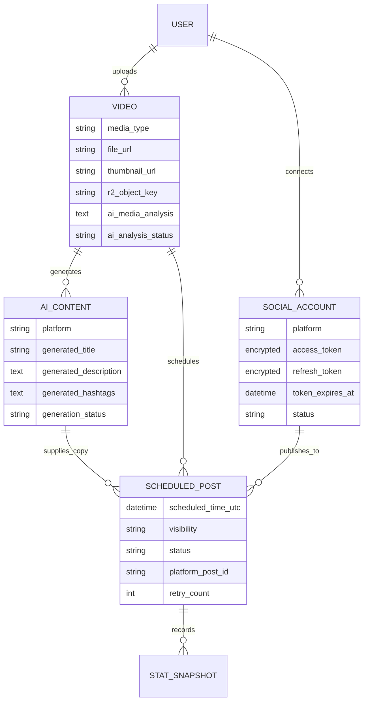

# AI Social Media Scheduler

Upload a video or image -> AI generates platform-appropriate titles, descriptions
and hashtags -> schedule a publish time -> the app auto-publishes to YouTube,
Instagram, and LinkedIn, even when your laptop is off. Built to run at $0/month.

## Architecture

One Django codebase runs in multiple execution contexts. The web app handles the
user workflow, while scheduled background jobs pick up due work through the
shared database.



### Runtime Contexts



### Upload, Generate, Schedule Flow



### Publishing Flow



### Data Model



## Tech Stack

Django 5.2, Neon Postgres, Cloudinary, Cloudflare R2, Google Gemini 2.5 Flash,
Render, GitHub Actions, WhiteNoise, Brevo or SMTP email, Telegram alerts, and
Fernet-encrypted OAuth tokens.

## Local Setup

```bash
python -m venv .venv
.venv/Scripts/activate          # Windows; use source .venv/bin/activate on macOS/Linux
pip install -r requirements.txt
cp .env.example .env            # then fill in keys; SQLite is used until DATABASE_URL is set
python manage.py migrate
python manage.py createsuperuser
python manage.py runserver
```

Generate the two keys you need for `.env`:

```bash
# DJANGO_SECRET_KEY
python -c "from django.core.management.utils import get_random_secret_key; print(get_random_secret_key())"

# TOKEN_ENCRYPTION_KEY
python -c "from cryptography.fernet import Fernet; print(Fernet.generate_key().decode())"
```

## Build Phases

- [x] Phase 0 - Foundation: project, models, encrypted tokens, deploy config
- [x] Phase 1 - Upload and storage with Cloudinary/R2 plus dashboard
- [x] Phase 2 - AI metadata and media analysis with Gemini
- [x] Phase 3 - YouTube integration
- [x] Phase 4 - Scheduler with `publish_due_posts` and cron
- [x] Phase 5 - Instagram integration
- [x] Phase 6 - LinkedIn integration
- [x] Phase 7 - Analytics, storage cleanup, notifications, timezone UI
- [ ] Phase 8 - Optional React frontend

## Security Notes

- OAuth tokens are encrypted at rest with Fernet via a custom model field.
- Tokens are not exposed in admin screens and are not logged.
- Secrets come from environment variables, Render env vars, and GitHub Secrets.
- Large uploads go directly from the browser to R2 using short-lived presigned URLs.
